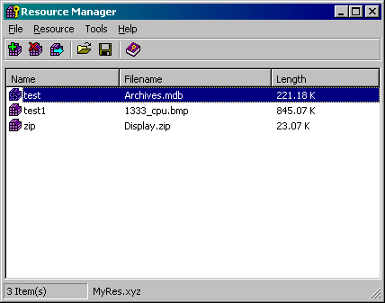



## External Resource Tool

### Description

This is a dll I use to store resource files that I don't want compiled with the exe. Maybe I plan on changing them later or I just want to store them all in one file instead of open in a directory.
 
### More Info
 
There are two parts to the resource tool, there is the dll that does all the work and can be used from your application to pull things from the resource file at runtime, and there is the application that uses makes the resource files (this just provides a user interface for you to use the dll and is not really needed, but helps)

             |
---                |---
**Submitted On**   |2001-12-16 05:43:58
**By**             |[Ed Marquez](https://github.com/Planet-Source-Code/PSCIndex/blob/master/ByAuthor/ed-marquez.md)
**Level**          |Advanced
**User Rating**    |5.0 (15 globes from 3 users)
**Compatibility**  |VB 6\.0
**Category**       |[OLE/ COM/ DCOM/ Active\-X](https://github.com/Planet-Source-Code/PSCIndex/blob/master/ByCategory/ole-com-dcom-active-x__1-29.md)
**World**          |[Visual Basic](https://github.com/Planet-Source-Code/PSCIndex/blob/master/ByWorld/visual-basic.md)
**Archive File**   |[External\_R580722272002\.zip](https://github.com/Planet-Source-Code/ed-marquez-external-resource-tool__1-32156/archive/master.zip)

